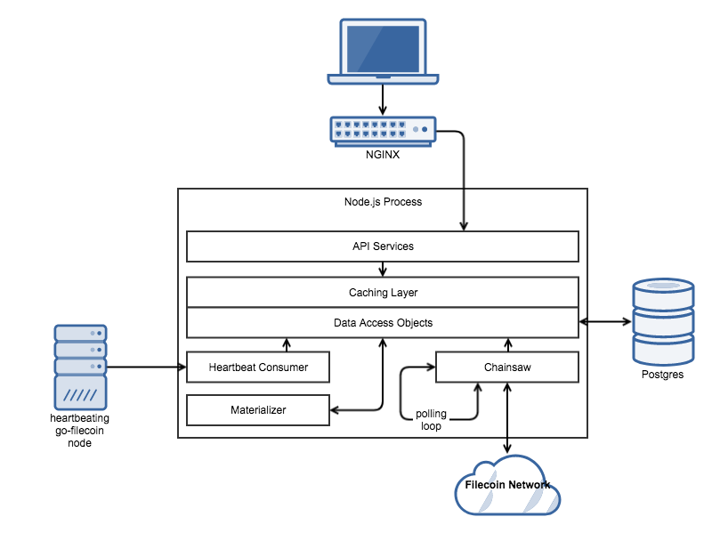

# Backend Architecture

##Node.js Process

The heart of the Dashboard’s backend is a Node.js web service. It talks to both a local go-filecoin instance, and a Postgres database. It is designed to loosely resemble a multitier web service: its internal components are organized into presentation, business logic, and data access tiers. The components within each tier are:

**Presentation:**

- APIServices: All components in this category implement the APIService interface. They are responsible for defining routes and responding to HTTP requests at those routes.

**Business Logic:**

- Chainsaw: This component continuously polls the Filecoin network and inserts new blocks and their associated messages into the database. Most stats are generated by querying blockchain messages.
- Materializer: This component performs expensive-to-compute database queries on a timer and stores their results in simple-to-query database tables.
- Cache: This component caches various pieces of data across the backend in order to serve responses more quickly.
- HeartbeatConsumer: This component listens for incoming heartbeats from go-filecoin nodes on the network, and maintains a list of heartbeating nodes and their statuses.

**Data Access:**

- Data Access Objects (DAOs): These components provide an interface to the underlying Postgres database. They are responsible for generating all SQL queries, and returning their results in a manner that the rest of the backend can understand.

This architecture was chosen for several reasons. First, by separating functionality into these distinct groups it makes future upgrades easier to implement. Second, the boundaries between each group need not be on the same machine: it is entirely possible, for example, for APIServices to be horizontally scaled across a fleet of “application servers” distinct from the Chainsaw and Materializer components. This makes it simpler for the application to scale as demand increases. Finally, we were able to minimize the number of components that can modify the database. This is important for scalability: some statistics are very expensive to compute, but by leveraging intelligent caching and offloading their computation to background tasks we can serve those statistics quickly to many users at once.

Below, see a diagram for how each of these components fit together:

In order to manage dependencies between each component, a custom inversion-of-control (IoC) container is used to instantiate them all when the application starts up. The IoC container’s API is loosely based off of Google’s Guice library - that is, classes and their dependencies are registered explicitly using method calls on the container itself rather than through runtime reflection.

We will now dig deeper into how core functionality is implemented using this architecture in order to illustrate it further.

## Serving Stats to the UI

Most of the UI’s requests for statistics hit a single endpoint: /sync. The sync endpoint returns all stats supported by the dashboard in a single call, in order to allow the UI to draw itself as soon as it receives data. The UI polls this endpoint in order to update itself. When a request to the sync endpoint is received, the following things happen:

1. The SyncAPI service’s sync handler responds to the request, and starts populating individual stats by calling into DAOs through the caching layer.
2. If the caching layer has a cached response for that particular stat, the cached value gets returned to the handler.
3. If the caching layer does not have a cached response, then the response is read from the database, converted into the format the API expects, cached, then returned to the handler.
4. The handler returns the response as a JSON object.

This process is the same for any non-sync endpoints. It is important to note that none of these requests modify state in any way: they do not manage a session, nor do they modify the database.

## Ingesting Chain State

As mentioned above, Chainsaw is the service responsible for ingesting new blocks and messages and persisting them to the database. The Materializer and the DAOs then use these messages to calculate stats. It works as follows:

1. On application startup, a 5 second timer is initiated. All below steps are executed on every tick of the timer.
2. Chainsaw collects block CIDs via the chain.ls API exposed on the local go-filecoin node.
3. For each CID, Chainsaw collects the blocks themselves.
4. For each message within each block, Chainsaw will:
	1. Deduplicate each message, since messages can appear multiple times in each tipset.
	2. Parse each message’s ABI.
	3. Turn the message into a JavaScript object.
5. Chainsaw then persists the blocks and messages into their respective database tables via ChainsawDAO.

## Handling Heartbeats

Heartbeats are a special case. Given that the number of nodes can be high - thousands, potentially - and that node data is read often, the list of currently heartbeating nodes is stored in memory and special care is taken to minimize the amount of third-party (i.e., to the database or the go-filecoin node) API calls made. Thus, when the APIService returns responses for the active nodes table, it is returning the contents of the list in-memory. When a heartbeat is received, the following things happen:

1. On application startup, a libp2p listener is created that listens for the heartbeating protocol.
2. For each new connection:
	1. If the node has been seen before and data is cached, do nothing.
	2. The connecting node’s name is checked against a list of banned words, and censored if it matches.
	3. The node’s location is calculated.
	4. The node’s power and capacity are calculated.
	5. The node’s block height is stored.
	6. All of the above data is cached.

## Caching

Caching is performed by MemoryCacheService, which implements the ICacheService interface. The cache is hidden behind an interface in order to make future upgrades - such as the addition of a dedicated caching system such as Redis - much easier. The cache services performs lazy and eager caching. Lazy caching will expire entries if they are requested after the cache is expires, and eager caches will automatically expire themselves.

Under the hood, the memory cache is simply a map of string keys to arbitrary values.

##Reading Chain State

The backend uses the go-filecoin API to retrieve chain state and generate stats. Most of this is handled by Chainsaw through the chain.ls and block.show API calls. The implementation that talks to the go-filecoin API is hidden behind a set of Client interfaces in order to make changing the implementation easier.

In order to generate meaningful data from on-chain messages, the backend parses the go-filecoin ABI. Specifically, this means decoding the sequence of bytes present in the “params” field of every on-chain message. In case additional messages need to be decoded, we’ll now describe how the ABI decoding component works. The exported constant in backend/src/client/ABI.ts - methodDecoders - maintains a mapping of method names to field types to decode. When chain.ls parses a message, it looks up the decoder in the map and passes the raw base64-encoded ABI parameters to the decoder. The decoder then generates an array of buffers from the CBOR-encoded parameters, and passes each element of that list to the decoder specified in the methodDecoders map.

This is the most brittle part of the system, since it is tightly coupled to the Filecoin protocol. **Removing this dependency would significantly improve the backend’s resilience to protocol changes.**

## Core Class Usage

### APIService

**Defined In:** backend/src/service/api/IAPIService.ts

**Usage:**

All API services conform to this interface. The interface exposes a namespace and a set of GET and POST endpoints via a map. The namespace represents the prefix all routes within this APIService should have, and the keys to the GET and POST endpoints represents the routes themselves after the prefix. The values of the map are typical Express request handlers, i.e., a method that takes an HTTP request and HTTP response as its only parameters.

### DAOs

**Defined In:** backend/src/service/dao/*

**Usage:**

DAOs themselves are simply interfaces that expose various stats. For example, StorageStatsDAO exposes a historicalMinerCountStats(duration) method that returns the historical miner counts for the given time interval.

Most DAOs inject an instance of PGClient, the class responsible for initiating the Postgres connection pool and exposing the query interface itself. By convention, DAOs expose a getStats() method that returns all stats necessary for the DAO to populate the sync endpoint.

### IoC Container

**Defined In:** src/registry.ts and src/Container.ts

**Usage:**

registry.ts contains the master list of all dependency-injected services in use by the backend. The default export is a method that receives an instance of the registry itself. You can call bind() on the registry with the service’s name, a factory method, and its list of dependent services by name to create a new dependency-injected service at application startup.

Duplicate services will throw an error at runtime. Similarly, circular dependencies will also throw an error at runtime.

Unfortunately, the values passed to the factory method are not subject to Typescript’s compile-time type checking, so be sure to pass the correct service names into the dependency list.

## Important Build Notes

## Debug Stub

The backend executes a postinstall step called “stub-debug.sh.” This postinstall step iterates through all of the backend’s dependencies, and replaces any instances of the Node.js “debug” package with a no-op. This is done in order to prevent memory leaks: the libp2p JavaScript implementation currently creates a new debug context for each connection, which cannot be garbage collected unless they are explicitly freed. Since the implementation is not explicitly freeing them and freeing them would require sweeping changes to the libp2p library, we made the decision to stub the dependency instead.

## Deployment Notes

The backend sits behind an NGINX proxy server. The proxy server is used for SSL termination, caching, rate limiting, and IP banning. Rate limiting and IP banning are relatively new changes that were added after we observed large volumes of automated traffic coming from a select few IPs.

The backend’s Node.js process is daemonized through systemd. The service name is stats.service. To run the process, a set of environment variables are provided in the systemd config that tell the process where it can find the following runtime dependencies:

- The database URL.
- The go-filecoin URL.
- Whether the node is the “master node” or not.
- The process’s peer ID for identification on the libp2p network.
- The heartbeat port.
- The API port.
- The log-level.

Logs are written to syslog, and are viewable via journalctl.

All of this configuration is currently automated via Terraform scripts in the go-filecoin repository.

## Stat Calculations

The most illustrative way to determine how an individual stat is calculated is by looking at the SQL queries in the DAOs used to generate each stat. This section will focus on stat calculations that may not be obvious at first, or require further explanation.

### Miner Pledge Sizes

The amount of data each miner pledges is calculated by summing the value of all the miner’s “createStorageMiner” messages. That value is then divided by 0.001, and multiplied by the sector size in gigabytes. This works because there is a fixed fee for each sector pledged, thus allowing us to divide the fixed fee by a fixed amount to yield the number of sectors. The sector size is currently fixed - which matches the current protocol - however future iterations of the dashboard can easily support flexible sector sizes by multiplying the value by the sector size as included in the createStorageMiner message’s first parameter.

### Duration Buckets

The generateDurationSeries method is used throughout the codebase to generate the SQL query fragment required to bucket data into yearly, monthly, weekly, or daily time windows. These buckets are then used to generate a sequence of intervals within the window to aggregate stats within. For example, a yearly window would yield 12 monthly intervals. Stats would then be aggregated (e.g., averaged) within that window for display.

### Miner Evolution

Miner evolution is a complicated stat. For each day rendered in the graph, the DAO calculates the percentage of the day’s blocks each miner mined. The application then selects the top three miners each day, and assigns the rest to an “Other” category.
